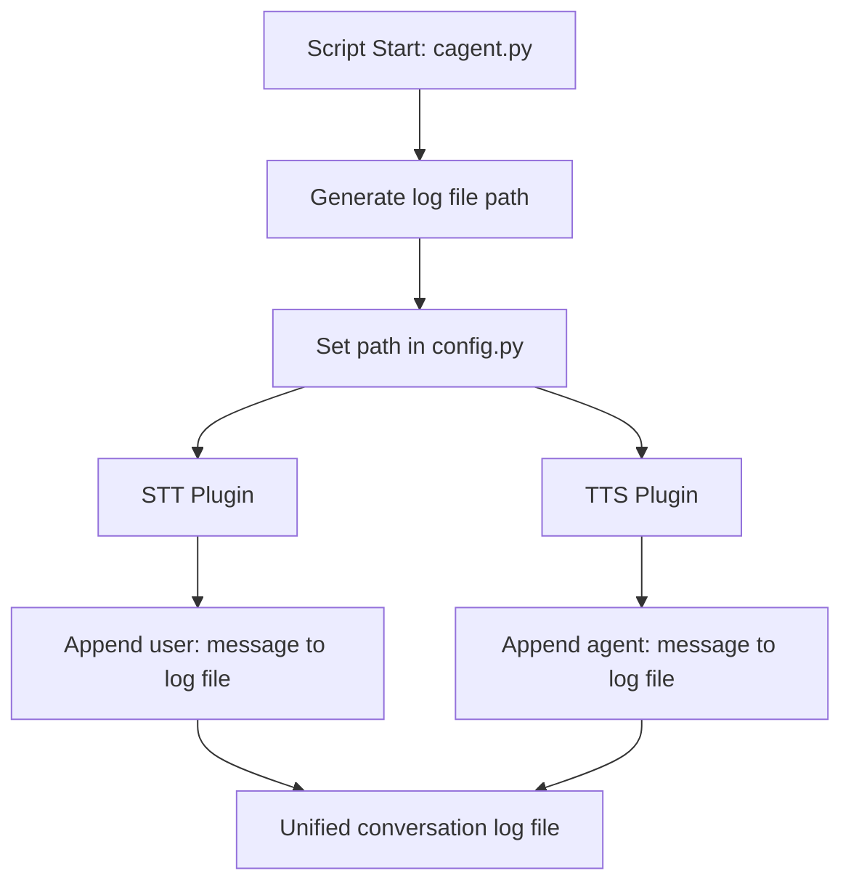

# Unified Conversation Logging: Detailed Documentation

This document explains how to log both user and agent messages to a single file per session in your LiveKit assistant project. It includes code changes, logic flow, and a flow diagram.

---

## Overview

- **Goal:** Store all user (STT) and agent (TTS) messages in a single log file per session.
- **Approach:** Generate the log file path once at script start, share it via a config module, and append all messages to it.

---

## Logic Flow

1. **Script Start (`cagent.py`)**
    - Generate a unique log file path using the current date and time.
    - Set this path in a shared config module (`config.py`).
2. **STT and TTS Plugins**
    - Import `config.py`.
    - When a message is processed, append it to the log file using the shared path.
    - Prefix each line with `user:` (STT) or `agent:` (TTS).
3. **Result**
    - All messages for a session are stored in a single file, with clear role prefixes.

---

## Flow Diagram



---

## Code Changes

### 1. `config.py`
**Purpose:** Centralized management of the conversation log file path.

```python
# d:/ML Folders/ml_env/GitHub/Friday/config.py
_conversation_log_path = None

def set_conversation_log_path(path: str):
    global _conversation_log_path
    _conversation_log_path = path

def get_conversation_log_path() -> str:
    if _conversation_log_path is None:
        raise RuntimeError("Conversation log path not set!")
    return _conversation_log_path
```

---

### 2. `cagent.py`
**Purpose:** Generate the log file path at script start and set it in `config.py`.

```python
# d:/ML Folders/ml_env/GitHub/Friday/cagent.py
import os
import datetime
import config

def setup_conversation_log():
    log_dir = os.path.join(os.path.dirname(__file__), "KMS", "logs")
    os.makedirs(log_dir, exist_ok=True)
    timestamp = datetime.datetime.now().strftime("%Y%m%d_%H%M%S")
    log_path = os.path.join(log_dir, f"conversation_{timestamp}.txt")
    config.set_conversation_log_path(log_path)

setup_conversation_log()
```
*Insert after your imports, before any session/agent creation.*

---

### 3. `tts.py` (Cartesia TTS plugin)
**Purpose:** Use the shared log file for agent messages.

```python
# d:/ML Folders/ml_env/Lib/site-packages/livekit/plugins/cartesia/tts.py
from __future__ import annotations
import config
# ...existing code...

class ChunkedStream(tts.ChunkedStream):
    # ...existing code...
    def _log_tts_input(self, text: str) -> None:
        try:
            log_file = config.get_conversation_log_path()
            with open(log_file, "a", encoding="utf-8") as f:
                f.write(f"agent: {text}\n")
        except Exception:
            pass

class SynthesizeStream(tts.SynthesizeStream):
    # ...existing code...
    def _log_tts_input(self, text: str) -> None:
        try:
            log_file = config.get_conversation_log_path()
            with open(log_file, "a", encoding="utf-8") as f:
                f.write(f"agent: {text}\n")
        except Exception:
            pass
```
*Remove any previous file path generation logic and use only `config.get_conversation_log_path()`.*

---

### 4. `stt.py` (Deepgram STT plugin)
**Purpose:** Use the shared log file for user messages.

```python
# d:/ML Folders/ml_env/Lib/site-packages/livekit/plugins/deepgram/stt.py
from __future__ import annotations
import config
# ...existing code...

class SpeechStream(stt.SpeechStream):
    # ...existing code...
    def _log_stt_output(self, text: str) -> None:
        try:
            log_file = config.get_conversation_log_path()
            with open(log_file, "a", encoding="utf-8") as f:
                f.write(f"user: {text}\n")
        except Exception:
            pass
```
*Remove any previous file path generation logic and use only `config.get_conversation_log_path()`.*

---

## Example Log File

```
user: Hello, how are you?
agent: I'm fine, thank you!
user: What's the weather today?
agent: The weather is sunny and 25°C.
```

---

## Best Practices & Notes

- Always set the log file path at the start of the script.
- Use a shared config module for easy access across plugins.
- Prefix each message with its role for clarity.
- You can extend this logic for JSON or other formats if needed.

---

## Troubleshooting

- If you see errors about `config` not being defined, ensure you have `import config` at the top of your plugin files.
- If the log file is not created, check directory permissions and paths.
- For multi-process setups, consider using a thread-safe or process-safe logging mechanism.
